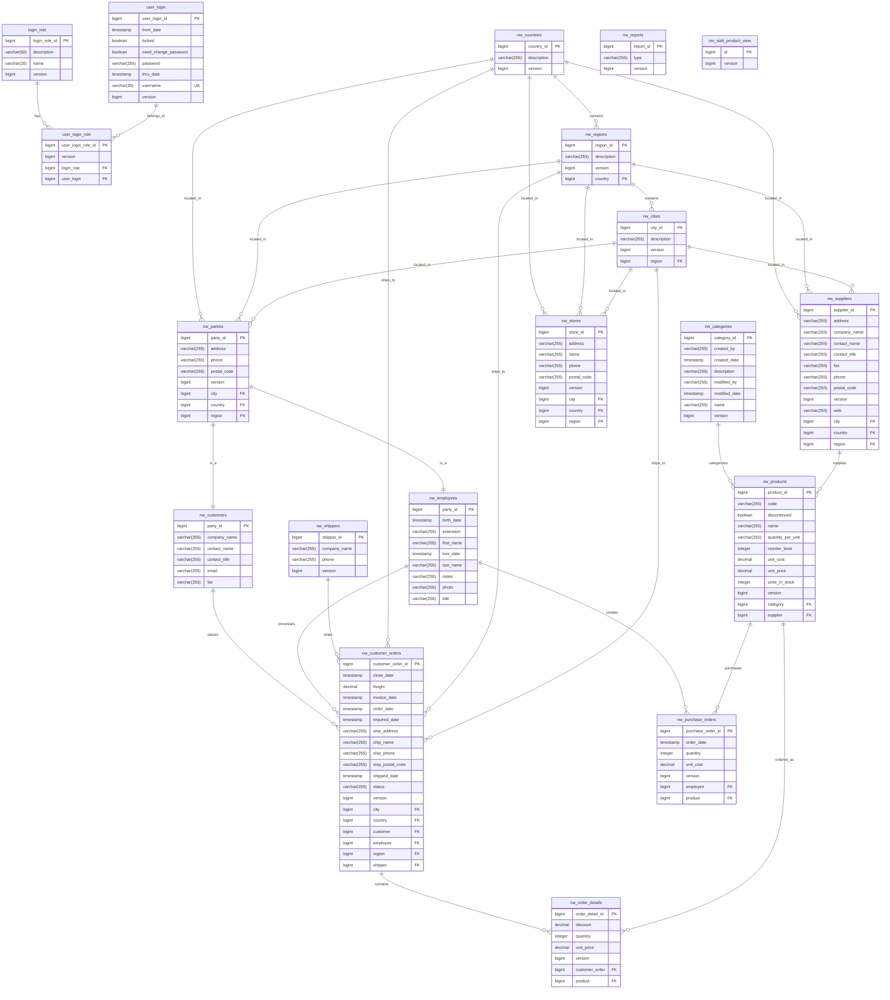

# Northwind Database ER Diagram

## Database Schema Overview

### Core Features:
1. **User Authentication System**: Multi-role user login system
2. **Geographic Hierarchy**: Countries → Regions → Cities
3. **Party Model**: Unified person/organization structure for customers and employees
4. **Product Management**: Categories and suppliers for products
5. **Order Processing**: Customer orders with detailed line items
6. **Purchase Management**: Purchase orders for inventory
7. **Store Management**: Physical store locations
8. **Reporting**: Built-in reporting capabilities

### Key Business Processes:
- Customer order management with shipping details
- Inventory management through purchase orders
- Multi-location store support
- Role-based user access control
- Supplier and category management for products
